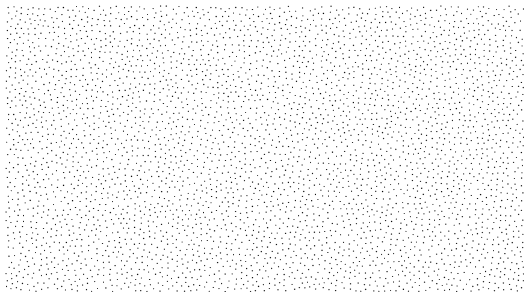

# Poisson disc distribution

A Poisson disc distribution produces randomised points that are close together
but not closer than a lower bound. It is a form of
[blue noise](https://en.wikipedia.org/wiki/Blue_noise#Blue_noise) that emulates
the arrangement of the eye's retina cells and works well for sampling. The
result is more aesthetically pleasing than uniform or jittered-grid approaches.



This code is a header-only, C++11 implementation of Bridson's
["Fast Poisson Disk Sampling in Arbitrary Dimensions"](http://www.cs.ubc.ca/~rbridson/docs/bridson-siggraph07-poissondisk.pdf)
in two-dimensions.

## Integration

The single header file, `poisson_disc_distribution.hpp` is in the `src`
directory. Integration is simply including the header,

```c++
#include "poisson_disc_distribution.hpp"
```

in the relevant files. C++11 or later must be enabled (e.g., `-std=c++11`,
`-std=c++14` for GCC and Clang).

## Example

An example use can be found in main.cpp, which prints out a distribution to the
terminal:

```c++
int main()
{
    constexpr auto width = 80;
    constexpr auto height = 40;

    char map[height][width] = {};

    auto seed = std::chrono::system_clock::now().time_since_epoch().count();

    std::default_random_engine engine{seed};
    std::uniform_real_distribution<float> distribution{0, 1};

    bridson::config conf;
    conf.width = width;
    conf.height = height;
    conf.min_distance = 4.0f;

    bridson::poisson_disc_distribution(
        conf,
        // random
        [&engine, &distribution](float range)
        {
            return distribution(engine) * range;
        },
        // in_area
        [](bridson::point p)
        {
            return p.x > 0 && p.x < width && p.y > 0 && p.y < height;
        },
        // output
        [&map](bridson::point p)
        {
            map[static_cast<int>(p.y)][static_cast<int>(p.x)] = '.';
        }
    );

    for (auto& row : map) {
        for (auto& cell : row) {
            std::cout << (cell ? cell : ' ');
        }

        std::cout << '\n';
    }

    return EXIT_SUCCESS;
}
```

## Customisation

The `in_area` parameter allows the user to decide where points are permitted.
The example code limits the points to a square:

```c++
[](point p)
{
    return p.x > 0 && p.x < width && p.y > 0 && p.y < height;
}
```

However, a simple tweak can create a spherical or elliptical (depending on the
aspect ratio) shape:

```c++
[](point p)
{
    float delta_x = (p.x / width) - 0.5f;
    float delta_y = (p.y / height) - 0.5f;

    return delta_x * delta_x + delta_y * delta_y < 0.25f;
}
```

## Reference

### config

The config structure has the following members:

- **width, height**. Defines the range of x as (0, width] and the range of y as
(0, height].

- **min_distance**. The smallest distance allowed between two points. Also,
points will never be further apart than twice this distance.

- **max_attempts**. The algorithm stochastically attempts to place a new point
around a current point. This number limits the number of attempts per point. A
lower number will speed up the algorithm but at some cost, possibly significant,
to the result's aesthetics.

- **start**. An optional parameter. If set to anything other than point's
default values (infinity, infinity) the algorithm will start from this point.
Otherwise a point is chosen randomly. Expected to be within the region defined
by width and height.

### poisson_disc_distribution

The poisson_disc_distribution function takes the following parameters:

- **conf**. The configuration, as detailed above.

- **random**. A callback of the form float(float limit) that returns a random
value ranging from 0 (inclusive) to limit (exclusive).

- **in_area**. A callback of the form bool(point) that returns whether a point
is within a valid area. This can be used to create shapes other than rectangles.
Points can't be outside of the defined limits of the width and height specified.
See the notes section for more.

- **output**. A callback of the form void(point). All points that are part of
the final Poisson disc distribution are passed here.

**Notes**

The in_area callback must prevent points from leaving the region defined by
width and height (i.e., 0 <= x < width and 0 <= y < height). If this is not
done invalid memory accesses will occur and most likely a segmentation fault.

This reference text is available as comments in the source code.

## Licence


Licensed under the [MIT Licence](https://opensource.org/licenses/MIT):

Copyright &copy; 2019 [Martyn Afford](https://mafford.com)

Permission is hereby granted, free of charge, to any person obtaining a copy of
this software and associated documentation files (the "Software"), to deal in
the Software without restriction, including without limitation the rights to
use, copy, modify, merge, publish, distribute, sublicense, and/or sell copies of
the Software, and to permit persons to whom the Software is furnished to do so,
subject to the following conditions:

The above copyright notice and this permission notice shall be included in all
copies or substantial portions of the Software.

THE SOFTWARE IS PROVIDED "AS IS", WITHOUT WARRANTY OF ANY KIND, EXPRESS OR
IMPLIED, INCLUDING BUT NOT LIMITED TO THE WARRANTIES OF MERCHANTABILITY,
FITNESS FOR A PARTICULAR PURPOSE AND NONINFRINGEMENT. IN NO EVENT SHALL THE
AUTHORS OR COPYRIGHT HOLDERS BE LIABLE FOR ANY CLAIM, DAMAGES OR OTHER
LIABILITY, WHETHER IN AN ACTION OF CONTRACT, TORT OR OTHERWISE, ARISING FROM,
OUT OF OR IN CONNECTION WITH THE SOFTWARE OR THE USE OR OTHER DEALINGS IN THE
SOFTWARE.
